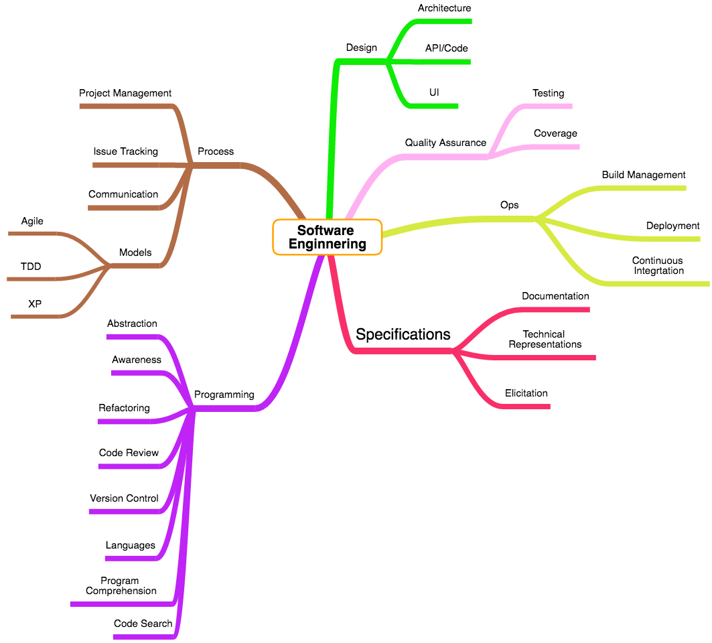

# UBC CPSC 507 - Advanced Software Engineering

January 3, 2017 -> April 6, 2017 (```2016T2```).

# Overview

Software is a human product. Developers are intrinsic to software development; as systems scale in size and complexity, the challenges that developers must overcome rapidly increase. The theme of this Advanced Software Engineering course will be 'Human Aspects of Software Engineering'. We will examine why creating software is a hard problem and how these problems have been addressed and evaluated both in research and practice. We will focus on development-based activities (rather than planning or requirements-based activities). The course will be seminar-based and will involve weekly reading and discussion. The project will involve building a software development tool to address a problem you have faced writing software yourself; this will likely involve a large amount of programming. This course is offered by the [Department of Computer Science](http://www.cs.ubc.ca/) at the [University of British Columbia](http://ubc.ca).


Lectures are held every Tuesday and Thursday from 11:00 to 12:20 in [ICICS 206](https://ssc.adm.ubc.ca/classroomservices/function/viewlocation?userEvent=ShowLocation&buildingID=ICCS&roomID=206). My office hours are by appointment but will be held in [ICICS 309](https://ssc.adm.ubc.ca/classroomservices/function/viewlocation?userEvent=ShowLocation&buildingID=ICCS&roomID=309). Official scheduling details can be found in the [SSC entry](https://courses.students.ubc.ca/cs/main?pname=subjarea&tname=subjareas&req=3&dept=CPSC&course=507).
						
<!--
Mindmap from the [first lecture](https://atlas.mindmup.com/2016/01/510bf7b0961a01335aad39f86ebdd48d/setopics/index.html).
-->						

The course will be adjusted according to your feedback, interests, and experience. This is an overview of the kinds of topics we could cover:

* software evolution
* program comprehension
* software visualization
* development team processes
* software development tools and environments
* quantitative &amp; qualitative evaluation of software engineering research

Mindmap from the first lecture:

  
						
## Contact

The best way to get in touch with me is via email. Office hours are by appointment, but after class will generally be a good time.


## Schedule

<!-- **Note: This is a tentative schedule that will firm up after the first week.** -->

| Week      	| Paper						                    | Presenter |
| :--       	|:--                                          | :--       |
| Jan 3    	| Course Intro 			                       | Reid   |
| Jan 5    	| Brooks. [No Silver Bullet](http://dx.doi.org/10.1109/MC.1987.1663532) | Reid Holmes  |
| Jan 10    	| Gibbs. [Software's Chronic Crisis](http://selab.csuohio.edu/~nsridhar/teaching/fall06/eec521/readings/Gibbs-scc.pdf)              | Reid Holmes   |
| Jan 12    	| Ko, DeLine, and Venolia. [Information Needs in Collocated Software Development Teams](http://dl.acm.org/citation.cfm?id=1248867) | Te Zhao   |
| Jan 17    	| Storey. [Theories, Tools and Research Methods in Program Comprehension: Past, Present and Future](http://dl.acm.org/citation.cfm?id=1147829) | Rodrigo Araujo  |
| Jan 19    	| Wettel, Lanza, and Robbes. [Software Systems as Cities: A Controlled Experiment](https://doi.org/10.1145/1985793.1985868) | Dylan Dong   |
| Jan 24    	| Shamshiri, Just, Rojas, Fraser, McMinn, and Arcuri. [Do Automatically Generated Unit Tests Find Real Faults? An Empirical Study of Effectiveness and Challenges](http://ieeexplore.ieee.org/document/7372009/) | Feng Gu   |
| Jan 26   	| Artzi, Kim, and Ernst. [ReCrash: Making Software Failures Reproducible by Preserving Object States](http://homes.cs.washington.edu/%7Emernst/pubs/reproduce-failures-ecoop2008.pdf) | Joey Eremondi   |
| Jan 31    	| Subramanian, Inozemtseva, and Holmes. [Live API Documentation](http://dl.acm.org/citation.cfm?id=2568313&CFID=870606460&CFTOKEN=99225515) | Jodi Spacek  |
| Feb 2    	| Endrikat, Hanenberg, Robbes, and Stefik. [How Do API Documentation and Static Typing Affect API Usability?](https://doi.org/10.1145/2568225.2568299) | Fabian Ruffy  |
| Feb 7    	| Ko, LaToza, and Burnett.	[A Practical Guide to Controlled Experiments of Software Engineering Tools with Human Participants](https://doi.org/10.1007/s10664-013-9279-3) | Reid Holmes  |
| Feb 9    	| Corbin and Strauss. [Grounded Theory Research: Procedures, Canons, and Evaluative Criteria](http://sites.duke.edu/niou/files/2014/07/W10-Corbin-and-Strauss-grounded-theory.pdf) | Reid Holmes  |
| Feb 14    	| Phillips, Zimmermann, and Bird. [Understanding and Improving Software Build Teams](https://doi.org/10.1145/2568225.2568274) | Nick Bradley   |
| Feb 16    	| Seo, Sadowski, Elbaum, Aftandilian, and Bowdidge. [Programmers' Build Errors: A Case Study (at Google)](http://dl.acm.org/citation.cfm?id=2568255) | Arthur Marques   |
| Feb 21    	| Reading Week 			             | *No Class*   |
| Feb 23    	| Reading Week 			             | *No Class*   |
| Feb 28    	| Herzig, Greiler, Czerwonka, and Murphy. [The Art of Testing Less without Sacrificing Quality](http://dl.acm.org/citation.cfm?id=2818754.2818815) | Itrat Akhter   |
| Mar 2    	| Bird, Nagappan, Devanbu, Gall, and Murphy. [Does Distributed Development Affect Software Quality? An Empirical Case Study of Windows Vista](https://doi.org/10.1145/1536616.1536639) | Mohammad Bajammal   |
| Mar 7    	| Bacchelli and Bird. [Expectations, Outcomes, and Challenges of Modern Code Review](http://dl.acm.org/citation.cfm?id=2486882) | Alistair Wick   |
| Mar 9    	| Ko. [Asking and Answering Questions about the Causes of Software Behavior ](https://faculty.washington.edu/ajko/papers/Ko2008Dissertation.pdf) (JUST pages 24-33) 			                       | Felix Grund   |
| Mar 14    	| Project Meetings 			          | TBD   |
| Mar 16    	| Project Meetings 			          | TBD   |
| Mar 21    	| Project Meetings                  | TBD   |
| Mar 23    	| Project Meetings 	                | TBD   |
| Mar 28    	| Project Presentations             | Everyone   |
| Mar 30    	| Project Presentations 	         | Everyone   |
| Apr 4    	| PC Meeting 			                | Everyone   |
| Apr 6    	| PC Meeting 			                | Everyone   |

						
						
## Course Format

This will be a paper-based seminar course. Each week we will read and discuss two papers. Everyone in the class will have an opportunity to give a ~30 minute paper presentation and lead a discussion ~30 minute discussion about the paper. While only one person will present each paper, it is expected that *everyone will read* all of the papers and contribute to the in-class discussion.

While reading the papers you should be able to answer the following five questions:

1. What were the primary contributions of the paper as the author sees it?
1. What were the main contributions of the paper as you (the reader) see it?
1. How does this work move the research forward (or how does the work apply to you)?
1. How was the work validated?
1. How could this research be extended?
1. How could this research be applied in practice?

Each week, you will also submit a review for each of the papers being presented that week at 0800 the day of class ([CPSC507 Paper Review Form](https://goo.gl/forms/6FDr8ZtlJhRijwX42)). The summary should be 300-500 words long. The discussion questions above (or the ones we talked about in the first class) can be used to help structure your review.

While presenters should keep these questions in mind, the audience in particular should think about them specifically while they are reading the paper. 

You will get to select the two papers you want to present from the course. Please make your selections from [this list](paperList.md). Once you have selected your papers, enter the details in the following [paper choice spreadsheet](https://docs.google.com/spreadsheets/d/1TJqM3I3lKDdOB2tF2Z0ZHO5Q4AyO7vcOGbT_78NSHMk/edit?usp=sharing). I will generate a cohesive class schedule once everyone has selected their papers. *This must be done by January 10 @ 0800.* 

The project is the primary artifact of the course; the outcome of all projects will be a research paper. In the last week of the class we will formally review all the papers from the course projects (using standard program committee review forms) and have a PC meeting describing the strengths and weaknesses of each paper. The reviews you produce will comprise 15% of your final mark.

The course will conclude with a formal Program Committee (PC) meeting. All projects will be submitted via a EasyChair (a conference management system). Each paper will receive at least 8 reviews from class members (I will review every paper). These peer-reviews will comprise 15% of the final mark. Michael Ernst has compiled a series of informative links for creating [effective reviews](http://www.cs.washington.edu/homes/mernst/advice/review-technical-paper.html). Here are links to two different reviews as well (one [positive](slides/icse2011review_ii.pdf) and one [negative](slides/icse2011review_crystal.pdf)) if you want concrete examples. *Remember, the final paper reviews must all be submitted to EasyChair by 0800 on April 3.*

## Project

The project forms an integral part of this course. The projects can be completed in groups of up to three. The intent of the project is to identify a real development shortcoming faced by engineers and create a tool to improve this problem.

There are three deliverables for your project:
							
* **Project proposal.** Before you undertake your project you will need to submit a proposal for approval. The proposal should be short (max 1 page PDF in <a href="http://www.acm.org/sigs/publications/proceedings-templates">ACM format</a>). The proposal should include a problem statement, the motivation for the project, and set of objectives you aim to accomplish. I will read these and provide comments. The proposal is not for marks but _must_ be completed in order to pass the course. If you wish to 'pitch' to the class to find additional team mates, please indicate this at the bottom of the proposal. For the pitch you will get 1-2 minutes to describe the project to try to entice others to join your group. NOTE: even if you pitch, you are still free to abandon your project and join a different one. **This will be due on January 20 @ 0800 via email.**

* **Written report.** The required length of the written report varies from project to project; all reports must be formatted according to the <a href="http://www.acm.org/publications/proceedings-template">ACM format</a> (use the ```sigconf``` style) and submitted as a PDF. This artifact will constitute 100% of the project grade. **This will be due on March 24 @ 0800 via Easychair.**

* **Project presentation.** Each group will present their project in class on March 28/30; presentation order will be chosen by lottery so everyone must have their presentations ready on the 28th. This presentation should take the form of a 15 minute (hard maximum) conference-style talk and describe the motivation for your work, what you did, and what you found. If a demo is the best way to describe what you did, feel free to include one in the middle of the talk. There will be time for questions after the presentation.

I have included a brief description of five of the projects from previous years.

* *Answering developers’ questions using information fragments in a heterogeneous development environment.* In this project, the authors developed a novel approach to model online programming threads (e.g., Stack Overflow). This paper was extended subsequent to the course and was published in VLHCC 2012.

* *Semantic-Based Code Search Evaluation: An Exploratory Study.* By evaluating three different code search engines, the authors aimed to identify high-level strengths and weaknesses that could be used to suggest future improvements for hybrid code search approaches.
	
* *NavTracks: The Next Generation.* This paper evaluated the existing NavTracks tool to determine how the tool worked in practice and to suggest future avenues for research in this space.

* *File Recommendation Based on File Interactions: A Clustering Approach to File Recommendations.* A new approach for leveraging code navigation paths (in a similar manner to NavTracks) was developed and the quality of the recommended artifacts evaluated.

* *Evaluation of Canada Health Infowayʼs Message Builder API and its documentation.* The authors evaluated the Infoway API and documentation to gain insight into the ease-of-use of this API by end-user developers.

## Assessment
* Seminar: 15%
* Seminar Paper Reviews: 15%
* Class Participation: 15%
* Project: 40%
* Project reviews: 15%


### Late Submissions

Late submissions cannot be accepted.


## Academic Conduct

Each student is responsible for understanding and abiding by the University and Departmental policies on academic conduct. Specifically:

* [UBC policy on Academic Misconduct](http://www.calendar.ubc.ca/vancouver/index.cfm?tree=3,54,111,959)
* [Computer Science Department Lab policies and responsibilities](https://www.cs.ubc.ca/our-department/administration/policies/collaboration)

## Respectful Environment

Everyone involved with CPSC 507 is responsible for understanding and abiding by UBC's [Respectful Environment Statement](http://www.hr.ubc.ca/respectful-environment/).

The Statement of Principle of UBC's Respectful Environment Statement is "The best possible environment for working, learning and living is one in which respect, civility, diversity, opportunity and inclusion are valued. Everyone at the University of British Columbia is expected to conduct themselves in a manner that upholds these principles in all communications and interactions with fellow UBC community members and the public in all University-related settings."
