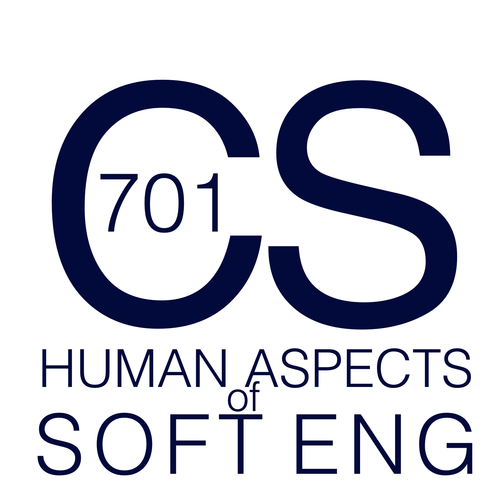

# EPFL CS 701 - Human Aspects Software Engineering

March 9, 2022 -> June 1, 2022

> This is an adaptation of UBC's CPSC 507 adapted to meet the interests and format of the EPFL community in Lausanne, Switzlerland.

# Overview

Software is a human product. Developers are intrinsic to software development; as systems scale in size and complexity, the challenges that developers must overcome rapidly increase. The theme of this Advanced Software Engineering course will be 'Human Aspects of Software Engineering'. We will examine why creating software is a hard problem and how these problems have been addressed and evaluated both in research and practice. We will focus on development-based activities (rather than planning or requirements-based activities). The course will be seminar-based and will involve weekly reading and discussion. In lieu of a project, I will work with all seminar participants to find ways to adapt course content to be useful for their own research projects.

This course is offered by the [School of Computer and Communication Sciences](https://www.epfl.ch/schools/ic/) at the [École Polytechnique Fédérale de Lausanne (EPFL)](http://epfl.ch).

Lectures are held every Wednesday from 1315 to 1500 in [INN 211](https://plan.epfl.ch/?room==INN%20211). My office hours are by appointment but will be held in [INN 241](https://plan.epfl.ch/?room==INN%20241). Official scheduling details can be found in the [EPFL description](https://edu.epfl.ch/studyplan/en/doctoral_school/computer-and-communication-sciences/coursebook/human-aspects-of-software-engineering-CS-701).

The course will be adjusted according to your feedback, interests, and experience. This is an overview of the kinds of topics we could cover:

* software evolution
* program comprehension
* software visualization
* development team processes
* software development tools and environments
* quantitative &amp; qualitative evaluation of software engineering research

## Schedule

**Note: This is a tentative schedule that will firm up after the second week.**

| Date      	| Paper						                    | Presenter |
| :--       	|:--                                          | :--       |
| Mar 9   	| Course Intro 			                       | Reid   |
| Mar 16    	| Brooks. [No Silver Bullet](http://dx.doi.org/10.1109/MC.1987.1663532). IEEE Computer, 1987.  | Reid |
| Mar 16    	| Gibbs. [Software's Chronic Crisis](http://selab.csuohio.edu/~nsridhar/teaching/fall06/eec521/). Scientific American, 1994. | Reid |
| Mar 23   	|	Sina Shamshiri, René Just, José M. Rojas, Gordon Fraser, Phil McMinn, and Andrea Arcuri. [Do Automatically Generated Unit Tests Find Real Faults? An Empirical Study of Effectiveness and Challenges.](https://doi.org/10.1109/ASE.2015.86) ASE, 2015. | Solal   |
| Mar 23   	| Mathieu Lavallee, Pierre N. Robillard. [Why Good Developers Write Bad Code: an Observational Case Study of the Impacts of Organizational Factors on Software Quality.](https://doi.org/10.1109/ICSE.2015.83) ICSE, 2015. | Zeinab   |
| Mar 30   	| Amy J. Ko, Rob DeLine, and Gina Venolia. [Information needs in collocated software development teams.](https://doi.org/10.1109/ICSE.2007.45) ICSE, 2007. 			                       | Reid   |
| Mar 30 | Emad Aghayia, Thomas D. LaTozaa, Paurav Surendraa, and Seyedmeysam Abolghasemib. [Crowdsourced Behavior-Driven Development.](https://cs.gmu.edu/~tlatoza/papers/jss2021.pdf) JSS, 2021. | Reid |
| Apr 6   	| Wen, Chen, Liu, Lou, Ma, Huang, Jin, and Liu. [An empirical study on challenges of application development in serverless computing.](https://doi.org/10.1145/3468264.3468558) ESEC/FSE 2021.  | Shanqing |
| Apr 6   	| Cojocaru, Uta, and Oprescu. [Attributes Assessing the Quality of Microservices Automatically Decomposed from Monolithic Applications.](https://dx.doi.org/10.1109/ISPDC.2019.00021) ISPDC 2019.  | Shanqing |
| Apr 13   	| Perf Testing TBD 			                       | TBD  |
| Apr 13   	| Perf Testing TBD 			                       | TBD  |
| Apr 20   	| Cancelled (Easter week) 	       |      |
| Apr 27   	| Cancelled (Reid away) 	         |      |
| May 4   	| TBD 			                       | TBD  |
| May 4   	| TBD 			                       | TBD  |
| May 11   	| TBD 			                       | TBD  |
| May 11   	| TBD 			                       | TBD  |
| May 18   	| TBD 			                       | TBD  |
| May 18   	| TBD 			                       | TBD  |
| May 25   	| Cancelled (Reid away)            |      |
| June 1   	| TBD 			                       | TBD  |
| June 1   	| TBD 			                       | TBD  |

