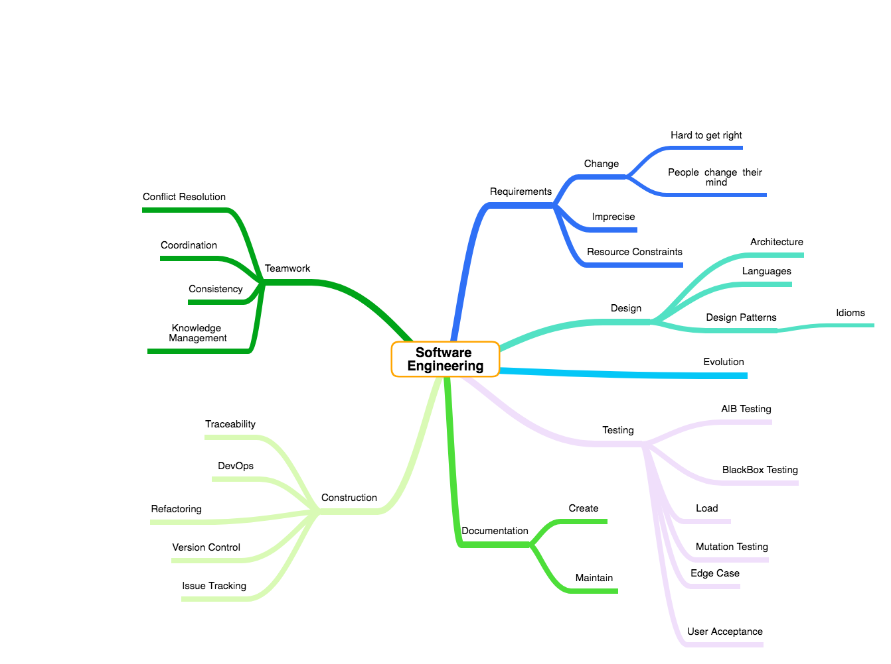

# UBC CPSC 507 - Human Aspects of Software Engineering

Sept 9, 2026 -> Dec 2, 2026 (```2026W1```).

Wednesdays 1400-1630 in TBD.


### **NOTE: Attending the first class and submitting your paper selections by the deadline is required to pass the course. If you cannot do this, please get in touch with the instructor before the first class / paper submission deadline**


# Overview
 
Software is a human product. Developers are intrinsic to software development; as systems scale in size and complexity, the challenges that developers must overcome rapidly increase. The theme of this Advanced Software Engineering course will be 'Human Aspects of Software Engineering'. We will examine why creating software is a hard problem and how these problems have been addressed and evaluated both in research and practice. We will focus on development-based activities (rather than planning or requirements-based activities). The course will be seminar-based and will involve weekly reading and discussion. The project will involve building a software development tool to address a problem you have faced writing software yourself; this will likely involve a large amount of programming. This course is offered by the [Department of Computer Science](http://www.cs.ubc.ca/) at the [University of British Columbia](http://ubc.ca).

<!-- Lectures are held every Tuesday and Thursday from 1000 to 1130 in ORCH 4068. My office hours are by appointment but will be held in [ICICS 309](https://ssc.adm.ubc.ca/classroomservices/function/viewlocation?userEvent=ShowLocation&buildingID=ICCS&roomID=309). Official scheduling details can be found in Workday. -->

The course will be adjusted according to your feedback, interests, and experience. This is an overview of the kinds of topics we could cover:

* software evolution
* program comprehension
* software visualization
* development team processes
* software development tools and environments
* quantitative &amp; qualitative evaluation of software engineering research

<!-- Mindmap from the [first lecture](mindmap.png). -->

<!--
Mindmap from the first lecture:

  
-->
					
## Contact

The best way to get in touch with me is via email. Office hours are by appointment, but after class will generally be a good time.

## Schedule

**Note: This is a tentative schedule that will firm up after the second week.**

| Date        | Paper						           | Presenter |
|:------------|:---------------------------------------|:----------|
| Sept 9  	  | Course Intro 			               | Reid      |

## Course Format

The main components of this course are described below:

### Seminar (15%; Paper choices due Sept 15 @ noon)

Each student will present one or two papers during the term and will lead a discussion of that paper. The presentation should last 20-30 minutes; discussions typically range 30-40 minutes. You will get to select the papers you want to present from the course. While a [paper list](paperList.md) is available if you need ideas, you are also free to suggest your own choices as long as they are in scope for the course. Please suggest three or four papers and enter the details in the following [Paper Choice Spreadsheet](https://docs.google.com/spreadsheets/d/1oKbKsSTw91Dntuc52Pn7WpFW8GvaO2O8K0mvSDvqR9I/edit?usp=sharing). I will generate a cohesive class schedule once everyone has selected their papers. You will likely only have to present two papers this term, but the additional options will make it easer to come up with a good schedule. 

### Class Participation (15%; Every class)

This is a seminar-based class that depends on your active participation to be successful. You will get out of these discussions what you put into them. Since every member of the class will have read every paper (and submitted a corresponding summary), everyone should come to class prepared to discuss each of the papers presented each week.

### Paper Reviews (15%; Due each week before class)

While reading the papers you should be able to answer the following five questions:

1. What were the primary contributions of the paper as the author sees it?
1. What were the main contributions of the paper as you (the reader) see it?
1. How does this work move the research forward (or how does the work apply to you)?
1. How was the work validated?
1. How could this research be extended?
1. How could this research be applied in practice?

Each week, you will also submit a review for each of the papers being presented that week at 2000 the day before class ([Paper Review Form](https://forms.gle/hfMKABHrPsZRbaDs7)). The summary should be 300-500 words long. The discussion questions above (or the ones we talked about in the first class) can be used to help structure your review.

While presenters should keep these questions in mind, the audience in particular should think about them specifically while they are reading the paper. 

### Project Proposal (v1 Due Sept 29 @ noon; v2 Due Oct 22 @ noon)

The project forms an integral part of this course. The projects can be completed in groups of up to three. The intent of the project is to identify a real development shortcoming faced by engineers and create a tool to improve this problem.
							
Before you undertake your project you will need to submit a proposal for approval. The proposal should be short (max 1 page PDF in <a href="http://www.acm.org/sigs/publications/proceedings-templates">ACM format</a>). The proposal should include a problem statement, the motivation for the project, and set of objectives you aim to accomplish. I will read these and provide comments. The proposal is not for marks but _must_ be completed in order to pass the course. **This first version will be due on Sept 29 @ noon via email.** Each proposal will receive feedback and will present a 5 minute presentation to the class for their project idea on **Oct 4**. Version 2 of the proposal should be submitted on **Oct 22 @ noon via email**. NOTE: You are still free to abandon your project and join a different one after the presentation, as long as you join a new group before the final proposal is submitted.

Here are a few projects students have completed in past years to get a flavour of their domain and complexity:

* *Answering developers’ questions using information fragments in a heterogeneous development environment.* In this project, the authors developed a novel approach to model online programming threads (e.g., Stack Overflow). This paper was extended subsequent to the course and was published in VLHCC.

* *Semantic-Based Code Search Evaluation: An Exploratory Study.* By evaluating three different code search engines, the authors aimed to identify high-level strengths and weaknesses that could be used to suggest future improvements for hybrid code search approaches.
	
* *NavTracks: The Next Generation.* This paper evaluated the existing NavTracks tool to determine how the tool worked in practice and to suggest future avenues for research in this space.

* *File Recommendation Based on File Interactions: A Clustering Approach to File Recommendations.* A new approach for leveraging code navigation paths (in a similar manner to NavTracks) was developed and the quality of the recommended artifacts evaluated.
  
### Project (40%; Final report due Nov 24 @ Noon)

* **Written report.** The required length of the written report varies from project to project; all reports must be formatted according to the <a href="https://www.acm.org/publications/proceedings-template">ACM format</a> (use the ```sigconf``` style) and submitted as a two-column PDF. This artifact will constitute 100% of the project grade. The report body must be 10 pages or less. You can add 2 additional pages of references and can additionally have appendicies if required. **Your final project report must be submitted using EsayChair by the deadline above.** [EasyChair Link](https://easychair.org/conferences/?conf=cpsc5072025)

* **Project presentation.** Each team will give a 15-minute conference style talk about their project in class. Since you only have 15 minutes (including questions) you will need to prioritize the work you did in the paper to fit the time limit (the 15 minute cap will be strictly enforced). With the late deadline, most people probably will not have read the paper, but will have access to it. Paper presentation order will be the reverse of the EasyChair submission order. **This will happen on Nov 26.**

### Project Reviews (15%; Due Dec 2 @ noon)

The project is the primary artifact of the course; the outcome of all projects will be a research paper. In the last week of the class we will formally review all the papers from the course projects (using standard program committee review forms) and have a PC meeting describing the strengths and weaknesses of each paper. The reviews you produce will comprise 15% of your final mark.

The course will conclude with a formal Program Committee (PC) meeting. All projects will be submitted via a EasyChair (a conference management system). Each paper will receive at least 6 reviews from class members (I will review every paper). Michael Ernst has compiled a series of informative links for creating [effective reviews](http://www.cs.washington.edu/homes/mernst/advice/review-technical-paper.html). A [differentiated review](slides/differentiatedReview.pdf) is provided for your consideration to help provide an example of good reviews for technical work. 

A conference review always contains the following elements (you should include each of these components):

* A paragraph or two summarizing what you took away from the paper. This helps the authors understand what _you_ understood the paper to be about, which is helpful for learning how the paper does/does not accurately convey what you expected.
* 2-4 strengths of the work.
* 2-4 weaknesses of the work.
* A paragraph describing the novelty and impact of the work. In the context of a course project, this often ends up examining how clearly the work is motivated and how the paper matches the motivation.
* A detailed review of the approach and its evaluation. This comprises the bulk of the review.

**The final paper reviews for all assigned papers must all be submitted using EasyChair.** [EasyChair Link](https://easychair.org/conferences/?conf=cpsc5072025)

### Late Submissions

Late submissions (for the project, paper reviews, and project reviews) cannot be accepted.


## Academic Conduct

Each student is responsible for understanding and abiding by the University and Departmental policies on academic conduct. Specifically:

* [UBC policy on Academic Misconduct](http://www.calendar.ubc.ca/vancouver/index.cfm?tree=3,54,111,959)
* [Computer Science Department Lab policies and responsibilities](https://www.cs.ubc.ca/our-department/administration/policies/collaboration)

## AI Tool Usage

You are permitted to use AI-based tools in this course. No restrictions are placed on how they are used for any software created to support your course project; the correct runtime behaviour of your programs are your responsibilty regardless of the tools used. With respect to any text-based submissions in this course, specifically the final project report, project reviews, and weekly paper reviews, AI tools can be used to correct _your_ writing, but cannot be used with _any_ text you did not author. Specifically, you are not allowed to provide any text you did not write yourself (e.g., you cannot upload _any_ text fragment or whole paper PDFs) into any tool, AI-based or not. If you (or your team) wrote the content though, you can upload this text to _improve_ your writing. That said, tools _cannot_ be used to do your writing for you. The easiest way to think about this is that no tool should return _more_ text than you uploaded yourself (e.g., suggestions for improvements on an uploaded paragraph is fine, but uploading a couple of bullet points and getting a paragraph back is not allowed). Regardless of the tools used, you are ultimately responsible any text submitted in this course and ensuring it faithfully, completely, and accurately reflects your work.

## Respectful Environment

Everyone involved with CPSC 507 is responsible for understanding and abiding by UBC's [Respectful Environment Statement](http://www.hr.ubc.ca/respectful-environment/).

The Statement of Principle of UBC's Respectful Environment Statement is "The best possible environment for working, learning and living is one in which respect, civility, diversity, opportunity and inclusion are valued. Everyone at the University of British Columbia is expected to conduct themselves in a manner that upholds these principles in all communications and interactions with fellow UBC community members and the public in all University-related settings."

<!--
2025
| Sept 10     | Brooks. [No Silver Bullet](http://dx.doi.org/10.1109/MC.1987.1663532). IEEE Computer, 1987.  | Reid |
| Sept 10 	  | Gibbs. [Software's Chronic Crisis](https://homepages.dcc.ufmg.br/~rodolfo/es-1-09/gibbs94SoftwareChronicCrisis.pdf). Scientific American, 1992. | Reid |
| Sept 17     | Johnson et. al. [Why don't software developers use static analysis tools to find bugs?](https://dx.doi.org/10.1109/ICSE.2013.6606613). ICSE, 2013. | Zung |
| Sept 17     | Lavallee et. al. [Why Good Developers Write Bad Code: An Observational Case Study of the Impacts of Organizational Factors on Software Quality](https://dx.doi.org/10.1109/ICSE.2015.83). ICSE, 2015. | Jenny |
| Sept 24     | Yang et. al. [On the Evaluation of Large Language Models in Unit Test Generation](https://dx.doi.org/10.1145/3691620.3695529). ASE, 2024. | Partha       |
| Sept 24     | Shamshiri et. al. [Do Automatically Generated Unit Tests Find Real Faults? An Empirical Study of Effectiveness and Challenges](https://dx.doi.org/10.1109/ASE.2015.86). ASE, 2015. | Zung |
| Oct 1       | 5 minute project pitches (no slides required, but you can have some if you want) | Everyone |
| Oct 1       | Seaman. [Qualitative Methods in Empirical Studies of Software Engineering](https://dx.doi.org/10.1109/32.799955). TSE 1999. | Alice |
| Oct 1       | Siegmund et. al. [Views on Internal and External Validity in Empirical Software Engineering](https://dx.doi.org/10.1109/ICSE.2015.24). ICSE, 2015. | Sarah |
| Oct 8       | Cancelled (Reid Away) 			                | N/A       |
| Oct 15      | Endrikat et. al. [How do API documentation and static typing affect API usability?](https://dx.doi.org/10.1145/2568225.2568299). ICSE, 2014. | Alan       |
| Oct 15      | Guo et. al. [Characterizing and Predicting Which Bugs Get Fixed: An Empirical Study of Microsoft Windows](https://dx.doi.org/10.1145/1806799.1806871). ICSE, 2010. | Partha |
| Oct 22      | Al-Kaswan et. al. [Code Red! On the Harmfulness of Applying Off-the-Shelf Large Language Models to Programming Tasks](https://dx.doi.org/10.1145/3729380). FSE, 2025. | Tawkat |
| Oct 22      | Sens et. al. [A Large-Scale Study of Model Integration in ML-Enabled Software Systems](https://dx.doi.org/10.1109/ICSE55347.2025.00185). ICSE 2025.	| Ayanfe |
| Oct 29      | Storey.	[Theories, Methods, and Tools in Program Comprehension: Past, Present, and Future](https://dx.doi.org/10.1109/WPC.2005.38). IWPC, 2005. | Sarah |
| Oct 29      | Ying et. al. [Selection and presentation practices for code example summarization.](https://dx.doi.org/10.1145/2635868.2635877). FSE, 2014. | Cheng |
| Nov 5       | Focused Project Prep (No Lecture) 			    | N/A       |
| Nov 12      | Cancelled: Reading Week  		                | N/A       |
| Nov 19      | Li et. al. [What Makes a Great Software Engineer?](https://dx.doi.org/10.1109/ICSE.2015.335). ICSE, 2015. | Alice |
| Nov 19      | Sillito et. al. [Questions Programmers Ask During Software Evolution Tasks](https://dx.doi.org/10.1145/1181775.1181779). FSE, 2006. | Alan |
| Nov 26      | Project Presentations 			                | Everyone  |
| Dec 3       | Presentations & Program Committee Meeting       | Everyone  | 
-->

<!--
2024
| Sept 10    	| Brooks. [No Silver Bullet](http://dx.doi.org/10.1109/MC.1987.1663532). IEEE Computer, 1987.                                                                                                                                                                                                | Reid                    |
| Sept 10 	| Gibbs. [Software's Chronic Crisis](https://homepages.dcc.ufmg.br/~rodolfo/es-1-09/gibbs94SoftwareChronicCrisis.pdf). Scientific American, 1992.                                                                                                                                            | Reid                    |
| Sept 12   	| Ernst et. al. Measure It? Manage It? Ignore It? Software Practitioners and Technical Debt. FSE 2015                                                                                                                                                                                        | Kyle                    |
| Sept 17       | Ko et. al. [Information Needs in Collocated Software Development Teams](https://doi.org/10.1109/ICSE.2007.45). ICSE 2007.                                                                                                                                                                  | Kyle                    |
| Sept 19       | Lavallee et. al. [Why Good Developers Write Bad Code: An Observational Case Study of the Impacts of Organizational Factors on Software Quality](https://dx.doi.org/10.1109/ICSE.2015.83). ICSE 2015                                                                                        | Zahin                   |
| Sept 24       | Herzig et. al. [The Art of Testing Less without Sacrificing Quality](https://doi.org/10.1109/ICSE.2015.66). ICSE 2015.                                                                                                                                                                     | Phoebe                  |
| Sept 26       | Focused Project Proposal Prep (No Lecture)                                                                                                                                                                                                                                                 | TBD                     |
| Oct 1         | Galhotra et. al. [Fairness testing: testing software for discrimination](https://doi.org/10.1145/3106237.3106277). FSE 2018.                                                                                                                                                               | Angie                   |
| Oct 3         | Project Pitches & Discussion                                                                                                                                                                                                                                                               | All                     |
| Oct 8         | Zhang et. al. [AutoCodeRover: Autonomous Program Improvement](https://arxiv.org/pdf/2404.05427). Arxiv 2024.                                                                                                                                                                               | Gauransh                |
| Oct 10         | Bird et. al. [Expectations, Outcomes, and Challenges of Modern Code Review](https://doi.org/10.1109/ICSE.2013.6606617). ICSE 2013.                                                                                                                                                         | Angie                   |
| Oct 15        | 1-1 Project Discussions                                                                                                                                                                                                                                                                    | Everyone (schedule TBD) |
| Oct 17        | Zhang et. al. [Interactive Code Review for Systematic Changes](https://doi.org/10.1109/ICSE.2015.33). ICSE 2015.                                                                                                                                                                           | Phoebe                  |
| Oct 22        | Endres et. al. [Can Large Language Models Transform Natural Language Intent into Formal Method Postconditions?](https://arxiv.org/pdf/2310.01831). Arxiv 2024.                                                                                                                             | Gauransh                |
| Oct 24        | Breu et. al. [Information needs in bug reports: improving cooperation between developers and users](https://doi.org/10.1145/1718918.1718973). CSCW 2010.                                                                                                                                   | Zahin                   |
| Oct 29        | Gupta et. al. [Growlithe: A Developer-Centric Compliance Tool for Serverless Applications](https://cirrus.ece.ubc.ca/papers/sp25_growlithe.pdf). SP 2025.                                                                                                                                  | Angie                   |
| Oct 31        | Zhang. [Detecting Code Comment Inconsistencies using LLM and Program Analysis](https://doi.org/10.1145/3663529.3664458). FSE 2024. & Stulova et. al. [Towards Detecting Inconsistent Comments in Java Source Code Automatically](https://doi.org/10.1109/SCAM51674.2020.00012). SCAM 2020. | Zahin & Phoebe          |
| Nov 5         | Johnson et. al. [Why don't software developers use static analysis tools to find bugs?](https://dl.acm.org/doi/10.5555/2486788.2486877). ICSE 2013.                                                                                                                                        | Kyle                    |
| Nov 7         | Manotas et. al. [An Empirical Study of Practitioners’ Perspectives on Green Software Engineering](https://doi.org/10.1145/2884781.2884810). ICSE 2016.                                                                                                                                     | Gauransh                |
| Nov 12        | Cancelled: Reading Week           		                                                                                                                                                                                                                                                       | N/A                     |
| Nov 14        | Focused Project Prep (No Lecture)           	                                                                                                                                                                                                                                              | N/A                     |
| Nov 19        | Focused Project Prep (No Lecture)           	                                                                                                                                                                                                                                              | N/A                     |
| Nov 21        | Focused Project Prep (No Lecture)           	                                                                                                                                                                                                                                              | N/A                     |
| Nov 26   	| <ol><li>Tandon. PyMetER: Python Method-Level Energy Repair.</li><li>DeMarco. Evaluating Design of Privacy Automation and Discussion from Code.</li></ol>                     		                                                                                                            | Everyone                |
| Nov 28   	| <ol><li>Chin. Do We Actually Need Source Code Comments?</li><li>Xu &amp; Wahab. DoctorPy: LLM-Driven IDE Extension Identifying Function-level Documentation Inconsistencies in Python.</li></ol>                     		                                                                    | Everyone                |
| Dec 3         | Project Review Prep (No Lecture)           	                                                                                                                                                                                                                                              | N/A                     |
| Dec 5   	| Program Committee Meeting         		                                                                                                                                                                                                                                                   | Everyone                |
-->

<!--
2022
| Sept 15   	| Carolyn B. Seaman. Qualitative Methods in Empirical Studies of Software Engineering. TSE 1999. | Reid   |
| Sept 15	| Card sort activity (No reading) | Reid | 
| Sept 20   	| Jonathan Sillito, Gail C. Murphy and Kris De Volder. Asking and Answering Questions during a Programming Change Task. IEEE Transactions on Software Engineering. 2008. 			                       | Aisha   |
| Sept 20   	| Martin P. Robillard, Wesley Coelho, and Gail C. Murphy. How Effective Developers Investigate Source Code: An Exploratory Study. TSE 2004. 			                       | Marie   |
| Sept 22   	| Sina Shamshiri, René Just, José M. Rojas, Gordon Fraser, Phil McMinn, and Andrea Arcuri. Do Automatically Generated Unit Tests Find Real Faults? An Empirical Study of Effectiveness and Challenges. ASE. 2015. 			                       | Tao   |
| Sept 27   	| Kim Herzig, Michaela Greiler, Jacek Czerwonka, Brendan Murphy. The Art of Testing Less without Sacrificing Quality. ICSE 2015. 			                       | Tarcisio   |
| Sept 29   	| Annie T. T. Ying, Martin P. Robillard. Selection and presentation practices for code example summarization. FSE 2014. 			                       | Akumah   |
| Oct 4   	| Project Pitches 			       | Everyone   |
| Oct 6   	| 2 papers: Edsger W. Dijkstra. Go to Statement Considered Harmful. CACM, 1968. Cory Kapser and Michael W. Godfrey. “Cloning Considered Harmful” Considered Harmful. WCRE 2006. | Jingxuan   |
| Oct 11   	| Emerson Murphy-Hill, Chris Parnin, Andrew P. Black. How we refactor, and how we know it. ICSE 2009. 			                       | Rui   |
| Oct 13   	| Emerson Murphy-Hill and Andrew P. Black. Breaking the Barriers to Successful Refactoring: Observations and Tools for Extract Method. ICSE 2008. 			                       | Madonna   |
| Oct 18   	| David Röthlisberger et. al. Exploiting Dynamic Information in IDEs Improves Speed and Correctness of Software Maintenance Tasks. TSE 2011. | Shizuko   |
| Oct 20   	| Cancelled 			                       | Cancelled   |
| Oct 25   	| Shay Artzi, Sunghun Kim, and Michael D. Ernst. ReCrash: Making software failures reproducible by preserving object states. ECOOP 2008. 			                       | Jifeng    |
| Oct 27   	| Don Dillman et. al. Internet, Phone, Mail, and Mixed-Mode Surveys: The Tailored Design Method. Ch. 4 (focus) & 5 (supplemental). (Ch 1 & 2 are also interesting) [[UBC Library]](https://ebookcentral.proquest.com/lib/ubc/reader.action?docID=1762797) [[CMU Materials]](https://github.com/bvasiles/empirical-methods/blob/master/pages/sep27-surveys.md)			                       | Reid   |
| Nov 1   	| Project Consultations | Reid   |
| Nov 3   	| Project Consultations | Reid   |
| Nov 8   	| Project Consultations			| Reid   |
| Nov 10   	| Project Consultations                 | Reid   |
| Nov 15   	| Cancelled 			               | Cancelled   |
| Nov 17   	| Enrico Fregnan et. al. First Come First Served: The Impact of File Position on Code Review. FSE 2022. | Nico   |
| Nov 22   	| Bird et. al. Does distributed development affect software quality? An empirical case study of Windows Vista. ICSE 2009. 			                       | Reid   |
-->

<!--
2018
| Date      	| Paper						                    | Presenter |
| :--       	|:--                                          | :--       |
| Jan 4   	| Course Intro 			                       | Reid   |
| Jan 9    	| Brooks. [No Silver Bullet](http://dx.doi.org/10.1109/MC.1987.1663532). IEEE Computer 1987.  | Reid |
| Jan 11 		| Gibbs. [Software's Chronic Crisis](http://selab.csuohio.edu/~nsridhar/teaching/fall06/eec521/readings/Gibbs-scc.pdf). Scientific American 1994. | Reid |
| Jan 16    	| Treude & Storey.[Awareness 2.0: staying aware of projects, developers and tasks using dashboards and feeds](https://doi.org/10.1145/1806799.1806854). ICSE 2010. | Patrick |
| Jan 18    	| Lavallee & Robillard. [Why Good Developers Write Bad Code: An Observational Case Study of the Impacts of Organizational Factors on Software Quality](https://dl.acm.org/citation.cfm?id=2818837). ICSE 2015. | Kristian |
| Jan 23    	| <ol><li>Begel & Simon. [Struggles of new college graduates in their first software development job](http://research.microsoft.com/pubs/75113/sigcse-begel-2008.pdf). SIGCSE 2008.</li><li>Ko et. al. [Information Needs in Collocated Software Development Teams](dl.acm.org/citation.cfm?id=1248867). ICSE 2007.</li></ol> | <ol><li>Dheeraj</li><li>Reid</li></ol> |
| Jan 25    	| Hartmann et. al. [What Would Other Programmers Do? Suggesting Solutions to Error Messages](https://pdfs.semanticscholar.org/17c9/8e98046bff6bbda658cb666f95da10fbb1f9.pdf). CHI 2010.  | Hongru |
| Jan 30    	| 5 minute project pitches  | Everyone | 
| Feb 1    	| <ol><li>Bird et. al. [Does distributed development affect software quality? An empirical case study of Windows Vista](//doi.org/10.1109/ICSE.2009.5070550). ICSE 2009.</li><li>Teasley et. al. [Rapid Software Development through Team Collocation](http://ieeexplore.ieee.org/document/1019481/). TSE 2002.</li></ol> | <ol><li>Anna</li><li>Lucas</li></ol> |
| Feb 6    	| Boshernitsan et. al. [Aligning development tools with the way programmers think about code changes](https://dl.acm.org/citation.cfm?id=1240715). CHI 2007. | May  |
| Feb 8    	| <ol><li>Kersten & Murphy. [Using task context to improve programmer productivity](https://doi.org/10.1145/1181775.1181777). FSE 2006.</li><li>Murphy-Hill & Murphy. [Recommendation Delivery. Recommendation Systems in Software Engineering](https://people.engr.ncsu.edu/ermurph3/papers/RSSE_Chapter.pdf). 2013.</li></ol> | <ol><li>Jan</li><li>Siyuan</li></ol>  |
| Feb 13    	| de Alwis & Murphy. [Answering Conceptual Queries with Ferret](http://ieeexplore.ieee.org/document/4814113/). ICSE 2008. | Matthew |
| Feb 15    	| Muşlu et. al. [Speculative Analysis of Integrated Development Environment Recommendations](https://doi.org/10.1145/2398857.2384665). OOPSLA 2012. | Puneet  |
| Feb 20    	| Reading Week | &nbsp; |
| Feb 22    	| Reading Week | &nbsp; |
| Feb 27    	| <ol><li>Endrikat et. al. [How do API documentation and static typing affect API usability?](https://doi.org/10.1145/2568225.2568299) ICSE 2014.</li><li>Rigby & Bird. [Convergent Software Peer Review Practices.](https://doi.org/10.1145/2491411.2491444) FSE 2013.</li></ol> | <ol><li>Haotian</li><li>Michael</li></ol> |
| Mar 1    	| Ying & Robillard. [Selection and Presentation Practices for Code Example Summarization](https://dl.acm.org/citation.cfm?id=2635877). FSE 2014. | Gleb  |
| Mar 6    	| Johnson et. al. [Why don't software developers use static analysis tools to find bugs?](http://citeseerx.ist.psu.edu/viewdoc/download?doi=10.1.1.384.7471&rep=rep1&type=pdf) ICSE 2013. | Renato  |
| Mar 8    	| Bettenburg et. al. [What Makes a Good Bug Report?](http://thomas-zimmermann.com/publications/files/bettenburg-fse-2008.pdf) FSE 2008. | Muhammad |
| Mar 13    	| Artzi et. al. [ReCrash: Making software failures reproducible by preserving object states](https://homes.cs.washington.edu/~mernst/pubs/reproduce-failures-ecoop2008.pdf). ECOOP 2008. | Nico |
| Mar 15    	| Herzig et. al. [The Art of Testing Less without Sacrificing Quality](http://dl.acm.org/citation.cfm?id=2818815). ICSE 2015. | Sam |
| Mar 20    	| TBD | TBD |
| Mar 22    	| TBD | TBD |
| Mar 27    	| TBD | TBD |
| Mar 29    	| TBD | TBD |
| Apr 3    	| In class project presentations. Reviews due. | &nbsp; |
| Apr 5    	| In class PC Meeting | &nbsp; |
-->

