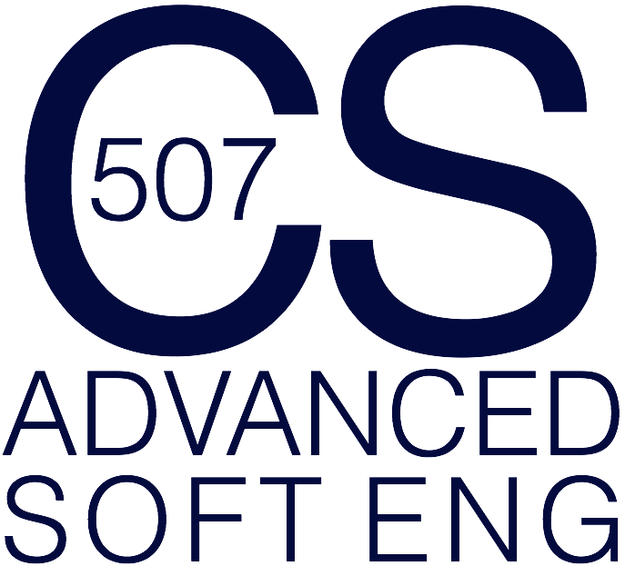

# UBC CPSC 507 - Advanced Software Engineering

## Upcoming Term

* [2026 September](https://github.com/ubccpsc/507/tree/2026sept)

### Past Terms

* [2025 September](https://github.com/ubccpsc/507/tree/2025sept)
* [2024 September](https://github.com/ubccpsc/507/tree/2024sept)
* [2022 September](https://github.com/ubccpsc/507/tree/2022sept)
* [2022 March](https://github.com/ubccpsc/507/tree/2022mar) Offered as CS 701 at EPFL in Lausanne, Switzerland
* [2018 September](https://github.com/ubccpsc/507/tree/2018sept)
* [2018 January](https://github.com/ubccpsc/507/tree/2018jan)
* [2017 January](https://github.com/ubccpsc/507/tree/2017jan)

